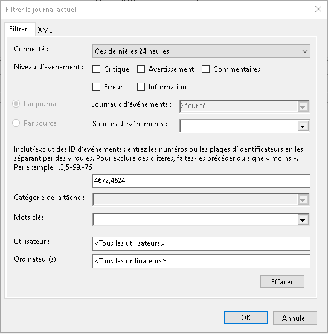
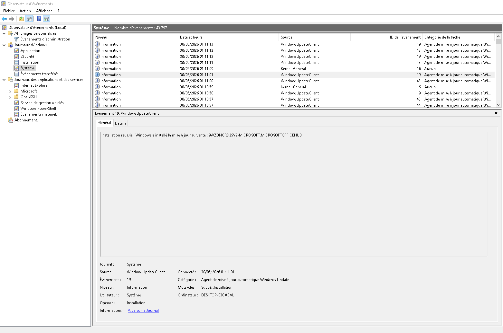
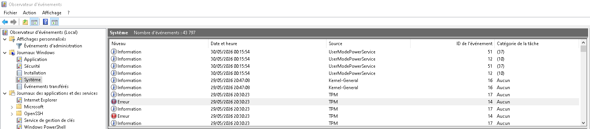

# L'Observateur Windows

# EXERCICE 1

Les principaux types de journaux sont : 
- Applications
- Sécurité
- Installation
- Système
- Evénements transférés

Il y a aussi les journaux des applications et des services ( OpenSSH , service de gestion de clés etc.. )

# EXERCICE 2

- Création du filtre

- Analyse un événement d'information du journal Système : que te dit l'ID de l'événement ?
Dans ce cas l'ID 19 est un ID de WindowsUpdateClient qui indique une installation de mise à jour

# EXERCICE 3

J'ai pris en exemple l'ID numéro 14 : 

J'ai trouvé pas mal d'informations sur ce lien : https://learn.microsoft.com/fr-fr/troubleshoot/windows-client/windows-security/tpm-device-driver-error-log

# CHALLENGE

Ma vue personnalisé permet de checker rappidement les logs de : 

- Démarrage du serveur DNS (2)
- Arrêt du serveur DNS (4)
- Erreur de résolution de nom (409)
- Echec de chargement de zone (501-502)
- Problèmes de réplication DNS (6001-6002)

Voir : Vue_Personnalisé_DNS.xml
